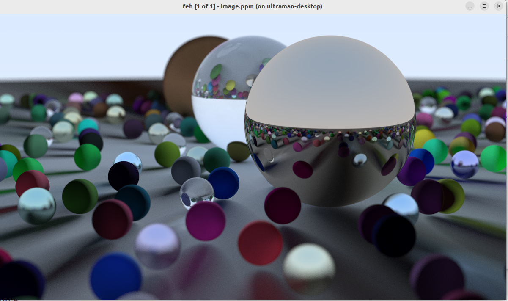

# Raytracer


- "Ray Tracing in One Weekend ([github](https://raytracing.github.io/books/RayTracingInOneWeekend.html#overview))" implemented in Rust 


## Usage 

```console
make open
```

make generate


